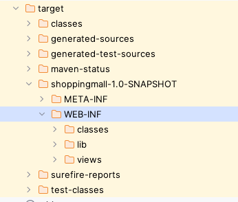

= ViewResolver

== WEB-INF/ 와  JSP
* `MVC Pattern` 에서 JSP는 view를 담당합니다. view에는 비즈니스 로직이 담겨있지 않습니다. 즉 독립적으로 JSP 파일이 호출되어선 안 됩니다.

* 컴파일 후 배포가 되면 `/WEB-INF/` 하위에 JSP 파일이 위치한다면 외부에서 직접 JSP 파일에 접근할 수 없도록 보호됩니다.
* `/WEB-INF/views/` 하위에 JSP 파일을 생성합니다.

== ViewResolver 역할

* ViewResolver는 `Controller(Command)`가 반환하는 viewName을 `WEB-INF/views` 하위에 있는 JSP 파일로 대응하는 역할을 합니다.
* ViewResolver에 의존하여 맵핑을 하면 JSP 파일의 위치가 WEB-INF/views에서 `WEB-INF/jsp` 로 변경이 되더라도 ViewResolver만 변경하면 됩니다.

== ViewResolver 구현

[source,java]
----
include::../../src/main/java/com/nhnacademy/shoppingmall/common/mvc/view/ViewResolver.java[]
----

== Test Code

[source,java]
----
include::../../src/test/java/com/nhnacademy/shoppingmall/check/common/mvc/view/ViewResolverTest.java[]
----